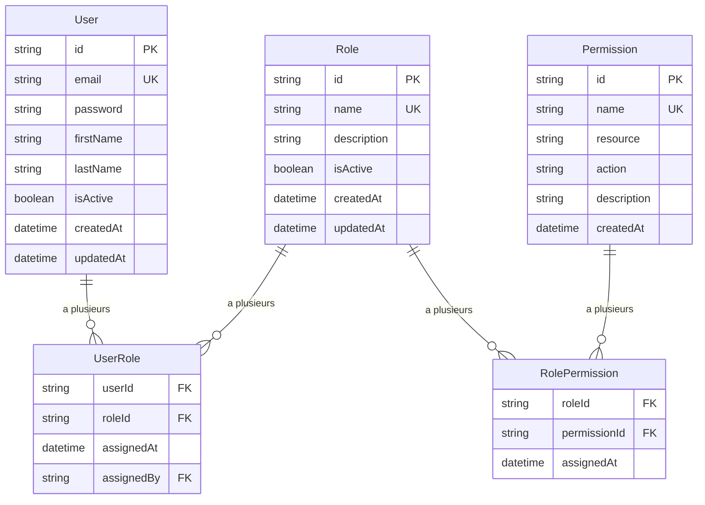
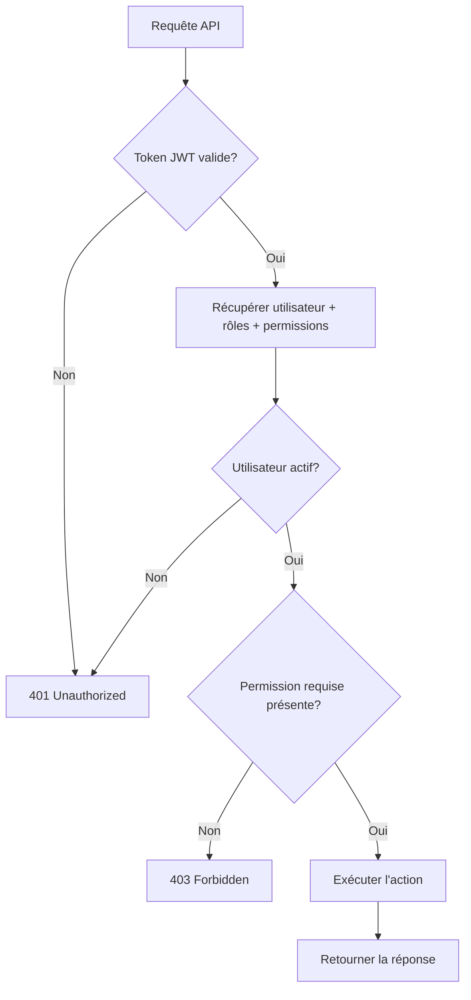
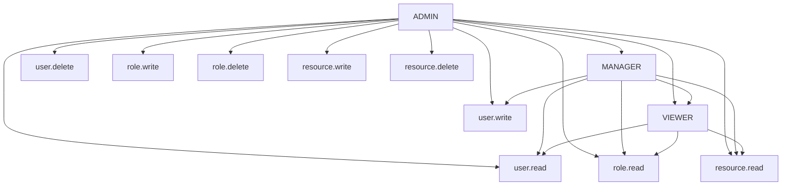
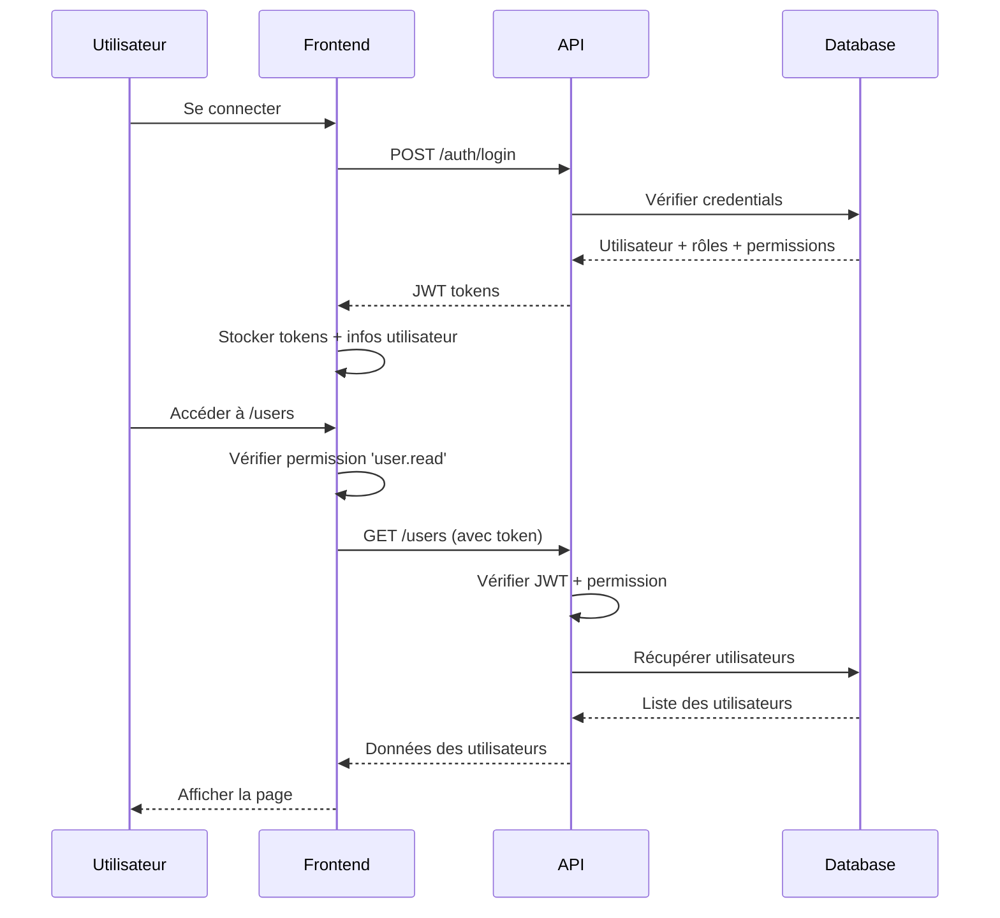
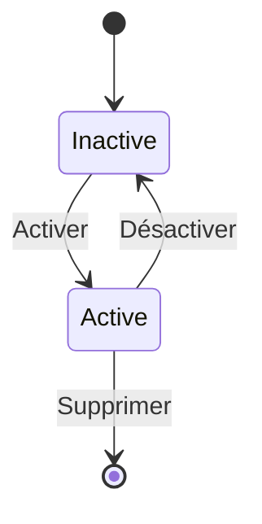
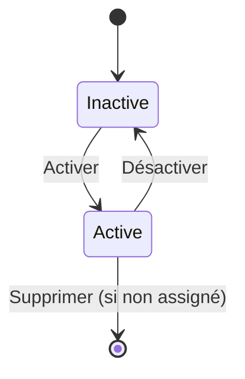

# Diagramme des Relations RBAC - AccessGate PoC

## 🏗️ Architecture des Entités

## 🔄 Flux d'Autorisation

## 🎭 Hiérarchie des Rôles

## 🔐 Matrice des Permissions

| Rôle | user.read | user.write | user.delete | role.read | role.write | role.delete | resource.read | resource.write | resource.delete |
|------|-----------|------------|-------------|-----------|------------|-------------|---------------|----------------|-----------------|
| ADMIN | ✅ | ✅ | ✅ | ✅ | ✅ | ✅ | ✅ | ✅ | ✅ |
| MANAGER | ✅ | ✅ | ❌ | ✅ | ❌ | ❌ | ✅ | ❌ | ❌ |
| VIEWER | ✅ | ❌ | ❌ | ✅ | ❌ | ❌ | ✅ | ❌ | ❌ |

## 🚀 Flux de Données Frontend

## 🛡️ Middleware Stack

```mermaid
graph LR
    A[Requête] --> B[Helmet]
    B --> C[Correlation ID]
    C --> D[Request Logger]
    D --> E[CORS]
    E --> F[Body Parser]
    F --> G[Rate Limiter]
    G --> H[Auth Middleware]
    H --> I[Permission Check]
    I --> J[Controller]
    J --> K[Response]
    K --> L[Error Handler]
```

## 📊 États des Entités

### User States

### Role States

## 🔍 Points de Contrôle de Sécurité

1. **Authentification** : JWT token valide
2. **Autorisation** : Permission requise présente
3. **État utilisateur** : Utilisateur actif
4. **État rôle** : Rôle actif
5. **Rate limiting** : Limite de requêtes respectée
6. **CORS** : Origine autorisée
7. **Validation** : Données d'entrée valides

## 📈 Métriques de Sécurité

- **Temps de réponse auth** : < 100ms
- **Taux d'erreur 401/403** : < 1%
- **Tentatives de connexion échouées** : Monitoring
- **Changements de permissions** : Audit log
- **Accès refusés** : Alertes automatiques
