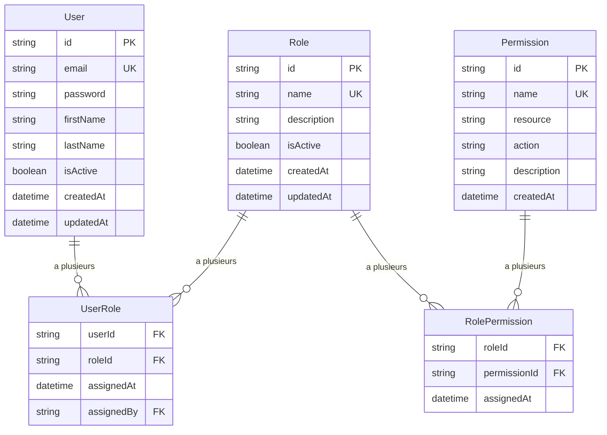

# Modèle RBAC - AccessGate PoC

## 🏗️ Architecture des données

### Entités principales

#### User (Utilisateur)
```typescript
interface User {
  id: string;           // UUID
  email: string;        // Email unique
  password: string;     // Hash bcrypt
  firstName: string;
  lastName: string;
  isActive: boolean;    // Actif/inactif
  createdAt: Date;
  updatedAt: Date;
}
```

#### Role (Rôle)
```typescript
interface Role {
  id: string;           // UUID
  name: string;         // ADMIN, MANAGER, VIEWER
  description: string;  // Description du rôle
  isActive: boolean;
  createdAt: Date;
  updatedAt: Date;
}
```

#### Permission (Permission)
```typescript
interface Permission {
  id: string;           // UUID
  name: string;         // user.read, role.write, etc.
  resource: string;     // user, role, resource
  action: string;       // read, write, delete
  description: string;
  createdAt: Date;
}
```

### Tables de liaison

#### UserRole (Utilisateur ↔ Rôle)
```typescript
interface UserRole {
  userId: string;       // FK vers User
  roleId: string;       // FK vers Role
  assignedAt: Date;
  assignedBy: string;   // FK vers User (qui a assigné)
}
```

#### RolePermission (Rôle ↔ Permission)
```typescript
interface RolePermission {
  roleId: string;       // FK vers Role
  permissionId: string; // FK vers Permission
  assignedAt: Date;
}
```

## 🎭 Rôles par défaut

### ADMIN
- **Description**: Accès complet au système
- **Permissions**:
  - `user.read`, `user.write`, `user.delete`
  - `role.read`, `role.write`, `role.delete`
  - `resource.read`, `resource.write`, `resource.delete`

### MANAGER
- **Description**: Gestion des utilisateurs
- **Permissions**:
  - `user.read`, `user.write`
  - `role.read`
  - `resource.read`

### VIEWER
- **Description**: Consultation seule
- **Permissions**:
  - `user.read`
  - `role.read`
  - `resource.read`

## 🔐 Permissions disponibles

### Utilisateurs
- `user.read` - Consulter les utilisateurs
- `user.write` - Créer/modifier les utilisateurs
- `user.delete` - Supprimer les utilisateurs

### Rôles
- `role.read` - Consulter les rôles
- `role.write` - Créer/modifier les rôles
- `role.delete` - Supprimer les rôles

### Ressources
- `resource.read` - Consulter les ressources
- `resource.write` - Modifier les ressources
- `resource.delete` - Supprimer les ressources

## 🔄 Relations



## 🎯 Logique d'autorisation

### Vérification des permissions
1. **Récupérer l'utilisateur** et ses rôles actifs
2. **Récupérer les permissions** de tous ses rôles
3. **Vérifier** si la permission requise existe
4. **Autoriser ou refuser** l'accès

### Exemple de vérification
```typescript
// L'utilisateur a-t-il la permission "user.write" ?
const hasPermission = await checkUserPermission(userId, 'user.write');

// Middleware d'autorisation
app.get('/users', requirePermission('user.read'), getUsers);
app.post('/users', requirePermission('user.write'), createUser);
app.delete('/users/:id', requirePermission('user.delete'), deleteUser);
```

## 📊 Données de seed

### Utilisateurs par défaut
- **admin@accessgate.com** (ADMIN)
- **manager@accessgate.com** (MANAGER)
- **viewer@accessgate.com** (VIEWER)

### Rôles par défaut
- ADMIN, MANAGER, VIEWER (avec descriptions)

### Permissions par défaut
- Toutes les permissions listées ci-dessus

## 🔒 Sécurité

### Contraintes
- **Email unique** par utilisateur
- **Rôles uniques** par nom
- **Permissions uniques** par nom
- **Cascade delete** pour les relations

### Validation
- **Format email** valide
- **Mot de passe** fort (8+ caractères)
- **Noms de rôles** en majuscules
- **Noms de permissions** en format `resource.action`

Ce modèle RBAC fournit une base solide et extensible pour le système de contrôle d'accès.
